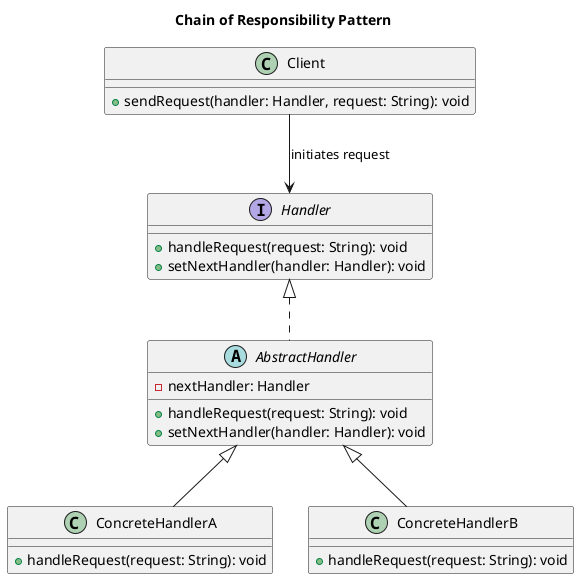

# Chain of Responsibility Pattern

## Category
Behavioral Design Pattern

---

## **Overview**

The **Chain of Responsibility Pattern** is a behavioral design pattern that enables a request to be passed along a chain of handlers. Each handler decides whether to process the request or pass it to the next handler in the chain. This approach decouples the sender and receiver, allowing multiple objects to have a chance to handle the request without the sender knowing which object will ultimately process it.

This pattern is particularly useful in scenarios where:
- Multiple objects can handle a request.
- The handler is determined dynamically at runtime.
- Requests need to be processed in a specific sequence.

---

## **Key Characteristics**

1. **Decoupled Sender and Receiver**:
   - The sender does not need to know which object in the chain will handle the request.

2. **Dynamic Request Handling**:
   - Handlers can be added, removed, or reordered without changing the sender’s logic.

3. **Single Responsibility Principle**:
   - Each handler in the chain focuses only on its specific area of responsibility.

4. **Extensibility**:
   - New handlers can be added easily without altering existing ones.

5. **Flexible Control Flow**:
   - The chain can terminate early if a handler processes the request or continue until all handlers have been executed.

---

## **UML Diagram**

The UML diagram below illustrates the Chain of Responsibility Pattern, highlighting the flow of requests between the client and the chain of handlers.



---

## **Implementation Walkthrough**

### **Participants**

1. **Handler**:
   - Abstract interface that defines a method to handle requests and set the next handler in the chain.

2. **ConcreteHandler**:
   - Implements the `Handler` interface and decides whether to process the request or pass it to the next handler.

3. **Client**:
   - Initiates the request and interacts with the first handler in the chain.

---

### **Example: Logging System**

#### Handler Interface
```java
/**
 * @brief Defines the interface for handling requests and chaining handlers.
 */
public abstract class Handler {
    private Handler nextHandler;

    public void setNextHandler(Handler nextHandler) {
        this.nextHandler = nextHandler;
    }

    public void handleRequest(String request) {
        if (nextHandler != null) {
            nextHandler.handleRequest(request);
        }
    }
}
```

---

#### Concrete Handlers
```java
/**
 * @brief Concrete handler for handling INFO-level logs.
 */
public class InfoHandler extends Handler {
    @Override
    public void handleRequest(String request) {
        if (request.equals("INFO")) {
            System.out.println("InfoHandler: Handling INFO log.");
        } else {
            super.handleRequest(request);
        }
    }
}

/**
 * @brief Concrete handler for handling ERROR-level logs.
 */
public class ErrorHandler extends Handler {
    @Override
    public void handleRequest(String request) {
        if (request.equals("ERROR")) {
            System.out.println("ErrorHandler: Handling ERROR log.");
        } else {
            super.handleRequest(request);
        }
    }
}
```

---

#### Client Code
```java
/**
 * @brief Client demonstrating the Chain of Responsibility Pattern.
 */
public class ChainOfResponsibilityDemo {
    public static void main(String[] args) {
        // Create handlers
        Handler infoHandler = new InfoHandler();
        Handler errorHandler = new ErrorHandler();

        // Set up the chain
        infoHandler.setNextHandler(errorHandler);

        // Make requests
        System.out.println("Client: Sending INFO request.");
        infoHandler.handleRequest("INFO");

        System.out.println("Client: Sending ERROR request.");
        infoHandler.handleRequest("ERROR");

        System.out.println("Client: Sending DEBUG request.");
        infoHandler.handleRequest("DEBUG");
    }
}
```

---

### **Output**
```
Client: Sending INFO request.
InfoHandler: Handling INFO log.
Client: Sending ERROR request.
ErrorHandler: Handling ERROR log.
Client: Sending DEBUG request.
```

---

## **Applications**

### **When to Use the Chain of Responsibility Pattern**

1. **Dynamic Request Handling**:
   - When multiple objects may handle a request, but the handler isn’t known until runtime.

2. **Request Filtering**:
   - When requests need to be processed in a specific sequence or passed through filters.

3. **Flexible Processing Logic**:
   - When you want to avoid hardcoding request handling logic.

### **Common Use Cases**

1. **Logging Systems**:
   - Different log levels (e.g., INFO, DEBUG, ERROR) handled by different components.

2. **Event Processing**:
   - Handling UI events like key presses or mouse clicks.

3. **Authentication and Authorization**:
   - Sequentially verifying credentials, roles, and permissions.

4. **Workflow Management**:
   - Approvals or escalations in multi-step workflows.

---

## **Advantages and Disadvantages**

### **Advantages**

1. **Loose Coupling**:
   - Decouples the sender and receiver, enabling independent evolution of both.

2. **Flexibility**:
   - Easily add, remove, or reorder handlers without altering the existing code.

3. **Scalability**:
   - Supports dynamic chains of arbitrary length.

### **Disadvantages**

1. **Performance Overhead**:
   - May result in unnecessary processing if the chain is long and unoptimized.

2. **Debugging Complexity**:
   - Tracking the flow of a request through the chain can be challenging.

3. **Unprocessed Requests**:
   - If no handler processes a request, it may go unnoticed.

---

## **Key Takeaways**

The **Chain of Responsibility Pattern** provides a flexible and extensible way to process requests by passing them along a chain of handlers. It is especially effective in scenarios requiring dynamic or hierarchical processing logic. However, it must be used carefully to avoid performance overhead and debugging challenges.

- **Use it when**: Multiple objects may need to handle a request, or when processing logic needs to be dynamic and extensible.
- **Avoid it when**: The chain is static, or when performance and traceability are critical concerns.