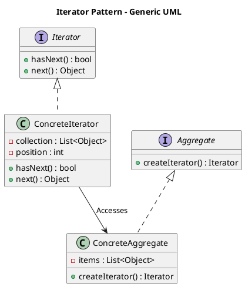

# Iterator Pattern

## Category
Behavioral Design Pattern

---

## Overview

The **Iterator Pattern** is a **behavioral design pattern** that provides a way to access elements of a collection sequentially without exposing the underlying representation. It separates the iteration logic from the collection's structure, enabling flexibility and reusability.

This pattern is particularly useful when:
- You need a uniform way to traverse different types of collections.
- You want to hide the internal details of a collection while still allowing external access.

---

## Key Characteristics

1. **Encapsulation of Iteration Logic**:
   - The iteration behavior is encapsulated in a separate `Iterator` object, isolating traversal logic from the collection.

2. **Multiple Iterators**:
   - Supports multiple iterators over the same collection without interfering with each other.

3. **Uniform Interface**:
   - Provides a consistent interface for traversing collections, regardless of their structure or implementation.

4. **Flexibility**:
   - Makes it easy to add new traversal strategies without modifying the collection's code.

5. **Separation of Concerns**:
   - Promotes the **Single Responsibility Principle** by separating traversal behavior from collection logic.

---

## UML Diagram

The UML diagram below illustrates the Iterator Pattern, showing the relationship between the `Iterator` interface, `ConcreteIterator`, `Aggregate`, and `ConcreteAggregate`:



---

## Implementation Walkthrough

### Participants

1. **Iterator**:
   - Defines an interface for accessing and traversing elements in a collection.
   - Methods typically include `next()`, `hasNext()`, and `current()`.

2. **Concrete Iterator**:
   - Implements the `Iterator` interface for a specific collection.

3. **Aggregate (or Collection)**:
   - Defines an interface for creating an `Iterator`.

4. **Concrete Aggregate (or Concrete Collection)**:
   - Implements the `Aggregate` interface to return an iterator for its collection.

5. **Client**:
   - Uses the `Iterator` to traverse the collection without knowing its internal details.

---

### Example: Book Collection Iterator

#### Iterator Interface
```java
/**
 * @brief Defines the interface for accessing and traversing elements.
 */
public interface Iterator<T> {
    boolean hasNext();
    T next();
}
```

---

#### Concrete Iterator
```java
/**
 * @brief Implements the Iterator interface for a BookCollection.
 */
public class BookIterator implements Iterator<Book> {
    private List<Book> books;
    private int position = 0;

    public BookIterator(List<Book> books) {
        this.books = books;
    }

    @Override
    public boolean hasNext() {
        return position < books.size();
    }

    @Override
    public Book next() {
        return books.get(position++);
    }
}
```

---

#### Aggregate Interface
```java
/**
 * @brief Defines the interface for creating an iterator.
 */
public interface Aggregate<T> {
    Iterator<T> createIterator();
}
```

---

#### Concrete Aggregate
```java
import java.util.ArrayList;
import java.util.List;

/**
 * @brief Implements the Aggregate interface for a collection of books.
 */
public class BookCollection implements Aggregate<Book> {
    private List<Book> books = new ArrayList<>();

    public void addBook(Book book) {
        books.add(book);
    }

    @Override
    public Iterator<Book> createIterator() {
        return new BookIterator(books);
    }
}
```

---

#### Client Code
```java
/**
 * @brief Demonstrates the Iterator Pattern with a BookCollection.
 */
public class IteratorPatternDemo {
    public static void main(String[] args) {
        BookCollection collection = new BookCollection();
        collection.addBook(new Book("Design Patterns"));
        collection.addBook(new Book("Clean Code"));
        collection.addBook(new Book("Refactoring"));

        Iterator<Book> iterator = collection.createIterator();
        while (iterator.hasNext()) {
            System.out.println(iterator.next());
        }
    }
}
```

---

### Output
```
Book: Design Patterns
Book: Clean Code
Book: Refactoring
```

---

## Applications

### When to Use the Iterator Pattern
1. **Uniform Traversal**:
   - When you need a standard way to iterate through different collections.
2. **Encapsulation**:
   - When you want to hide the internal representation of a collection.
3. **Multiple Traversals**:
   - When you need to support multiple simultaneous iterations of the same collection.

### Common Use Cases
1. **Data Structures**:
   - Traversing lists, stacks, queues, and trees.
2. **UI Frameworks**:
   - Iterating over UI components or DOM elements.
3. **Database Results**:
   - Traversing records in a result set.

---

## Advantages and Disadvantages

### Advantages
1. **Encapsulation**:
   - Separates collection traversal logic from its implementation.
2. **Flexibility**:
   - Supports different traversal algorithms without modifying the collection.
3. **Reusability**:
   - The iterator can be reused across different collections with minimal changes.
4. **Simplifies Clients**:
   - The client doesn’t need to manage traversal logic, reducing complexity.

### Disadvantages
1. **Overhead**:
   - Introduces additional classes for the iterator.
2. **Limited Direct Access**:
   - Some operations (e.g., random access) may be less efficient compared to direct access.
3. **Potential Tight Coupling**:
   - If the iterator is tightly coupled to the collection, changes to the collection may require updates to the iterator.

---

## Comparison with Other Patterns

| **Pattern**   | **Purpose**                                        | **Key Difference**                                  |
|---------------|----------------------------------------------------|----------------------------------------------------|
| **Iterator**  | Provides sequential access to a collection.        | Focused on traversal logic.                       |
| **Composite** | Treats individual objects and compositions uniformly. | Handles tree structures and hierarchies.          |
| **Visitor**   | Performs operations on elements of an object structure. | Focused on extending behaviors without changing objects. |

---

## Key Takeaways

The Iterator Pattern simplifies traversal through collections by encapsulating the iteration logic in a dedicated class. It adheres to the **Single Responsibility Principle**, allowing collections to focus solely on their data storage and management. While it introduces some overhead, the benefits of flexibility and encapsulation make it invaluable for handling diverse collections.