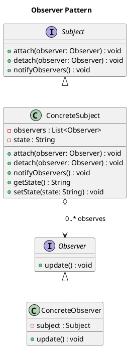

# Observer Pattern

## Category
Behavioral Design Pattern

---

## Overview

The **Observer Pattern** is a **behavioral design pattern** that establishes a one-to-many dependency between objects. When the **subject** (or observable) changes state, all its dependent **observers** are automatically notified and updated. This pattern is particularly useful for implementing distributed event-handling systems and ensuring loose coupling between objects.

### Real-World Analogy:
Consider a subscription service where users subscribe to receive updates (e.g., newsletters). When the service publishes a new newsletter, all subscribed users are notified.

---

## Key Characteristics

1. **One-to-Many Relationship**:
   - The subject maintains a list of observers. Changes in the subject trigger updates to all registered observers.

2. **Loose Coupling**:
   - The subject and observers are loosely coupled. Observers only depend on the subject's notification mechanism, not its implementation.

3. **Dynamic Behavior**:
   - Observers can be added or removed at runtime, providing flexibility in managing dependencies.

4. **Push vs. Pull**:
   - Notification can either **push** data to observers or allow observers to **pull** data from the subject.

5. **Decoupled Communication**:
   - Promotes separation of concerns, enabling easier testing, maintenance, and scalability.

---

## UML Diagram

The UML diagram below illustrates the Observer Pattern, showing the relationship between the subject and its observers:



---

## Implementation Walkthrough

### Participants

1. **Subject**:
   - Maintains a list of observers and provides methods to attach, detach, and notify them of state changes.

2. **Observer**:
   - Defines an interface for objects that need to be notified of changes in the subject.

3. **ConcreteSubject**:
   - Stores the state of interest and implements methods to notify observers when the state changes.

4. **ConcreteObserver**:
   - Implements the observer interface and updates its state based on notifications from the subject.

---

### Example: Weather Monitoring System

#### Subject Interface
```java
/**
 * @brief The Subject interface for managing observers.
 */
public interface Subject {
    void attach(Observer observer);
    void detach(Observer observer);
    void notifyObservers();
}
```

#### ConcreteSubject
```java
import java.util.ArrayList;
import java.util.List;

/**
 * @brief A concrete implementation of the Subject interface.
 */
public class WeatherStation implements Subject {
    private List<Observer> observers = new ArrayList<>();
    private String weatherData;

    public void setWeatherData(String data) {
        this.weatherData = data;
        notifyObservers();
    }

    public String getWeatherData() {
        return weatherData;
    }

    @Override
    public void attach(Observer observer) {
        observers.add(observer);
    }

    @Override
    public void detach(Observer observer) {
        observers.remove(observer);
    }

    @Override
    public void notifyObservers() {
        for (Observer observer : observers) {
            observer.update();
        }
    }
}
```

#### Observer Interface
```java
/**
 * @brief The Observer interface for receiving updates.
 */
public interface Observer {
    void update();
}
```

#### ConcreteObserver
```java
/**
 * @brief A concrete implementation of the Observer interface.
 */
public class WeatherDisplay implements Observer {
    private WeatherStation station;

    public WeatherDisplay(WeatherStation station) {
        this.station = station;
        station.attach(this);
    }

    @Override
    public void update() {
        System.out.println("Weather updated: " + station.getWeatherData());
    }
}
```

#### Client Code
```java
/**
 * @brief Demonstrates the Observer Pattern with a weather monitoring system.
 */
public class ObserverPatternDemo {
    public static void main(String[] args) {
        WeatherStation station = new WeatherStation();

        WeatherDisplay display1 = new WeatherDisplay(station);
        WeatherDisplay display2 = new WeatherDisplay(station);

        station.setWeatherData("Sunny");
        station.setWeatherData("Rainy");
    }
}
```

### Output
```
Weather updated: Sunny
Weather updated: Sunny
Weather updated: Rainy
Weather updated: Rainy
```

---

## Applications

### When to Use the Observer Pattern
1. When multiple objects depend on the state of another object and need to be notified of changes.
2. When the system must dynamically add or remove dependencies between objects.
3. When implementing distributed event-handling systems.

### Common Use Cases
1. **Event Listeners**:
   - GUI components listening for user input or system events.
2. **Publish-Subscribe Systems**:
   - News services, stock tickers, or RSS feeds.
3. **Model-View Synchronization**:
   - Keeping UI views updated with changes in the underlying model.

---

## Advantages and Disadvantages

### Advantages
1. **Loose Coupling**:
   - Subjects and observers remain independent of each other’s implementations.
2. **Flexibility**:
   - Observers can be dynamically added or removed.
3. **Scalability**:
   - Suitable for systems requiring real-time notifications to multiple components.

### Disadvantages
1. **Overhead**:
   - Managing a large number of observers can increase complexity and resource usage.
2. **Notification Delays**:
   - If the subject frequently changes state, frequent notifications can slow the system.
3. **Memory Leaks**:
   - Failing to properly detach observers can lead to memory leaks.

---

## Comparison with Similar Patterns

| **Pattern**       | **Focus**                                      | **Key Difference**                                      |
|--------------------|------------------------------------------------|--------------------------------------------------------|
| **Observer**       | One-to-many dependency                        | Notifies multiple observers of changes in the subject. |
| **Mediator**       | Centralized communication                     | Manages communication between multiple components.     |
| **Publish-Subscribe** | Asynchronous, message-based communication  | Observers subscribe to specific events or topics.      |

---

## Key Takeaways

The **Observer Pattern** facilitates real-time updates and dynamic relationships between objects, making it ideal for event-driven systems. While it enhances scalability and flexibility, careful management of observers is crucial to avoid pitfalls like memory leaks and excessive notification overhead.