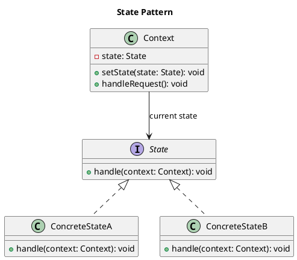

# State Pattern

## Category
Behavioral Design Pattern

---

## Overview

The **State Pattern** is a **behavioral design pattern** that allows an object to alter its behavior when its **internal state** changes. The object will appear to change its class by delegating the behavior to the current state object.

This pattern is particularly useful when:
- An object’s behavior depends on its state.
- The object needs to change its behavior dynamically during runtime.
- You want to avoid complex conditional statements that determine the object's behavior.

The **State Pattern** promotes **single responsibility** by encapsulating state-specific behavior into separate classes and adhering to the **Open-Closed Principle**, allowing for easy addition of new states without altering existing code.

---

## Key Characteristics

1. **Encapsulation of State**:
   - The state-specific logic is encapsulated in separate classes, reducing complexity and improving maintainability.

2. **Dynamic Behavior**:
   - The object’s behavior changes dynamically as its internal state changes, achieved through delegation.

3. **Eliminates Conditionals**:
   - Removes the need for complex conditional statements (e.g., `if-else` or `switch-case`) to handle state-dependent behavior.

4. **Promotes Open-Closed Principle**:
   - New states can be added without modifying the existing code.

5. **Context-Driven**:
   - A **Context** class manages the current state and delegates behavior to the state objects.

---

## UML Diagram

The UML diagram below illustrates the **State Pattern**. The **Context** interacts with the **State** interface, which is implemented by various concrete state classes to provide state-specific behavior.



---

## Implementation Walkthrough

### Participants

1. **State**:
   - Defines the interface for all concrete states.

2. **Concrete States**:
   - Implement state-specific behavior.
   - Handle requests and may transition the context to a different state.

3. **Context**:
   - Maintains a reference to the current state.
   - Delegates requests to the current state object.

---

### Example: Document Workflow

A document transitions through various states such as **Draft**, **Moderation**, and **Published**. Each state defines behavior for actions like `publish()` and `reject()`.

---

#### State Interface
```java
/**
 * @brief State interface that declares actions.
 */
public interface State {
    void publish(Document context);
    void reject(Document context);
}
```

---

#### Concrete States
```java
/**
 * @brief Draft state implementation.
 */
public class DraftState implements State {
    @Override
    public void publish(Document context) {
        System.out.println("Draft is now under moderation.");
        context.setState(new ModerationState());
    }

    @Override
    public void reject(Document context) {
        System.out.println("Draft has been rejected.");
    }
}

/**
 * @brief Moderation state implementation.
 */
public class ModerationState implements State {
    @Override
    public void publish(Document context) {
        System.out.println("Document is now published.");
        context.setState(new PublishedState());
    }

    @Override
    public void reject(Document context) {
        System.out.println("Document has been sent back to draft.");
        context.setState(new DraftState());
    }
}

/**
 * @brief Published state implementation.
 */
public class PublishedState implements State {
    @Override
    public void publish(Document context) {
        System.out.println("Document is already published.");
    }

    @Override
    public void reject(Document context) {
        System.out.println("Published document cannot be rejected.");
    }
}
```

---

#### Context
```java
/**
 * @brief Document context that manages states.
 */
public class Document {
    private State state;

    public Document() {
        this.state = new DraftState(); // Default state
    }

    public void setState(State state) {
        this.state = state;
    }

    public void publish() {
        state.publish(this);
    }

    public void reject() {
        state.reject(this);
    }
}
```

---

#### Client Code
```java
/**
 * @brief Demonstrates the State Pattern.
 */
public class StatePatternDemo {
    public static void main(String[] args) {
        Document document = new Document();

        document.publish(); // Transition to Moderation
        document.publish(); // Transition to Published
        document.reject();  // Invalid action
    }
}
```

---

### Output
```
Draft is now under moderation.
Document is now published.
Published document cannot be rejected.
```

---

## Applications

### When to Use the State Pattern

1. **Dynamic State Changes**:
   - When an object’s behavior changes based on its internal state.
   - Example: Document workflow systems, video game characters.

2. **Avoiding Complex Conditionals**:
   - When you want to eliminate large conditional statements to manage state transitions.

3. **Encapsulation of Behavior**:
   - When state-specific behavior needs to be isolated for clarity and reusability.

### Common Use Cases

1. **Workflow Systems**:
   - Document states: Draft, Moderation, Published.
   - Order states: New, Processing, Shipped, Delivered.

2. **Game Development**:
   - Character states: Idle, Running, Jumping, Attacking.

3. **UI Components**:
   - Button states: Enabled, Disabled, Hovered, Clicked.

4. **Finite State Machines**:
   - Devices with distinct modes of operation (e.g., On/Off, Standby, Sleep).

---

## Advantages and Disadvantages

### Advantages
1. **Improved Readability**:
   - Encapsulates state-specific behavior in distinct classes, making the code easier to read and maintain.

2. **Extensibility**:
   - New states can be added without modifying existing code, adhering to the **Open-Closed Principle**.

3. **Encapsulation**:
   - Reduces coupling by isolating state logic from the context.

4. **Dynamic Behavior**:
   - Allows objects to change their behavior dynamically at runtime.

### Disadvantages
1. **Increased Class Count**:
   - Introduces multiple state classes, increasing code complexity.

2. **Context Awareness**:
   - States need to be aware of the context to perform transitions, potentially increasing coupling.

3. **Overhead**:
   - May introduce overhead if the application has simple state transitions.

---

## Key Takeaways

The **State Pattern** is ideal for managing objects with dynamic behavior driven by internal states. By encapsulating state-specific logic into separate classes, this pattern improves maintainability and simplifies code. However, it may introduce complexity in scenarios with simple state transitions.

- **Use it when**: An object’s behavior needs to change dynamically based on its state.
- **Avoid it when**: The number of states is fixed and minimal, or the transitions are straightforward.