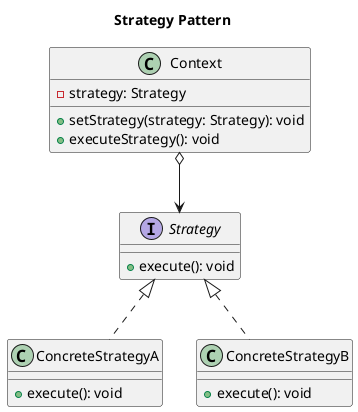

# Strategy Pattern

## **Category**
Behavioral Design Pattern

---

## **Overview**

The **Strategy Pattern** is a behavioral design pattern that enables a class's behavior to be selected at runtime. Instead of implementing multiple algorithms or behaviors directly in a class, the pattern delegates this functionality to separate classes, each encapsulating a specific behavior or algorithm. 

This allows for easy swapping of algorithms, adherence to the **Open-Closed Principle** (open for extension, closed for modification), and promotes a flexible design.

---

## **Key Characteristics**

1. **Encapsulation of Algorithms**:
   - Each algorithm is encapsulated in its own class, implementing a common interface. 
   - The client does not need to know which algorithm is being used.

2. **Runtime Flexibility**:
   - The behavior of a class can be changed dynamically by swapping strategies during execution.

3. **Separation of Concerns**:
   - The context class is decoupled from the specific implementation of algorithms, allowing it to focus on its core responsibilities.

4. **Adherence to the Open-Closed Principle**:
   - New strategies can be added without modifying the existing code.

5. **Elimination of Conditional Logic**:
   - Replaces long conditional statements with polymorphism, improving maintainability.

---

## **UML Diagram**

The UML diagram below illustrates the Strategy Pattern, where the `Context` class delegates algorithm execution to a `Strategy` object.



---

## **Implementation Walkthrough**

### **Participants**

1. **Strategy (Interface)**:
   - Defines a common interface for all supported algorithms or behaviors.
   - Example: `Strategy` interface with a `execute()` method.

2. **Concrete Strategies**:
   - Implement the `Strategy` interface to provide specific algorithms or behaviors.
   - Example: `ConcreteStrategyA` and `ConcreteStrategyB`.

3. **Context**:
   - Maintains a reference to a `Strategy` object and delegates the execution of behavior to it.
   - Example: A `Context` class that uses a `Strategy` object to perform operations.

---

### **Example: Payment Processing System**

In a payment system, you might have different payment methods such as credit card, PayPal, and cryptocurrency. Each payment method implements a common interface (`PaymentStrategy`), and the client (the payment processor) uses the appropriate strategy at runtime.

#### **1. Strategy Interface**
```java
/**
 * @brief Interface for payment strategies.
 */
public interface PaymentStrategy {
    void pay(double amount);
}
```

---

#### **2. Concrete Strategies**
```java
/**
 * @brief Concrete strategy for credit card payments.
 */
public class CreditCardPayment implements PaymentStrategy {
    private String cardNumber;

    public CreditCardPayment(String cardNumber) {
        this.cardNumber = cardNumber;
    }

    @Override
    public void pay(double amount) {
        System.out.println("Paid " + amount + " using credit card: " + cardNumber);
    }
}

/**
 * @brief Concrete strategy for PayPal payments.
 */
public class PayPalPayment implements PaymentStrategy {
    private String email;

    public PayPalPayment(String email) {
        this.email = email;
    }

    @Override
    public void pay(double amount) {
        System.out.println("Paid " + amount + " using PayPal: " + email);
    }
}
```

---

#### **3. Context Class**
```java
/**
 * @brief Context class for managing payment strategies.
 */
public class PaymentProcessor {
    private PaymentStrategy paymentStrategy;

    public void setPaymentStrategy(PaymentStrategy paymentStrategy) {
        this.paymentStrategy = paymentStrategy;
    }

    public void processPayment(double amount) {
        if (paymentStrategy == null) {
            throw new IllegalStateException("Payment strategy not set");
        }
        paymentStrategy.pay(amount);
    }
}
```

---

#### **4. Client Code**
```java
/**
 * @brief Demonstrates the Strategy Pattern.
 */
public class StrategyPatternDemo {
    public static void main(String[] args) {
        PaymentProcessor processor = new PaymentProcessor();

        // Pay using credit card
        processor.setPaymentStrategy(new CreditCardPayment("1234-5678-9012-3456"));
        processor.processPayment(100.0);

        // Pay using PayPal
        processor.setPaymentStrategy(new PayPalPayment("user@example.com"));
        processor.processPayment(200.0);
    }
}
```

---

#### **Output**
```
Paid 100.0 using credit card: 1234-5678-9012-3456
Paid 200.0 using PayPal: user@example.com
```

---

## **Applications**

### **When to Use the Strategy Pattern**

1. **Multiple Algorithms**:
   - When a class needs to support multiple algorithms or behaviors, and these can vary at runtime.
   - Example: Sorting algorithms, payment methods.

2. **Avoiding Conditional Logic**:
   - When complex conditional statements are used to determine which behavior to execute.
   - Example: Using polymorphism to replace `if-else` or `switch-case` constructs.

3. **Adherence to Open-Closed Principle**:
   - When you need to add new algorithms or behaviors without modifying existing code.
   - Example: Adding new shipping methods to an e-commerce platform.

---

## **Advantages and Disadvantages**

### **Advantages**
1. **Flexibility**:
   - Allows dynamic switching of algorithms or behaviors at runtime.

2. **Code Reusability**:
   - Encapsulated strategies are reusable across different contexts.

3. **Testability**:
   - Strategies can be tested independently of the context.

4. **Extensibility**:
   - New strategies can be added without modifying existing code.

---

### **Disadvantages**
1. **Increased Complexity**:
   - Introduces additional classes for each strategy, increasing codebase size.

2. **Overhead**:
   - Requires careful management of strategy objects, especially if they involve state.

3. **Tight Coupling with Context**:
   - The context must be aware of the `Strategy` interface, which can create dependencies.

---

## **Comparison with Related Patterns**

- **State vs. Strategy**:
  - Both patterns encapsulate behavior in separate classes and use composition to delegate functionality, but their **intent** and **usage** differ:
    - **State Pattern** focuses on modeling **state-dependent behavior** where the object's behavior changes automatically based on its internal state. Transitions between states are managed within the states themselves.
    - **Strategy Pattern** emphasizes defining **interchangeable algorithms** or behaviors. The client explicitly selects and assigns the desired strategy to the context, and there are no automatic transitions. 
  - **Key Difference**: The **State Pattern** manages transitions between states internally, while the **Strategy Pattern** requires the client to choose and assign behaviors explicitly.

- **Decorator Pattern**:
   - Both promote flexibility and adherence to the Open-Closed Principle.
   - **Difference**: The `Decorator` pattern dynamically adds responsibilities to objects, while the `Strategy` pattern dynamically swaps algorithms.

---

## **Key Takeaways**

- The **Strategy Pattern** is ideal for systems requiring multiple interchangeable behaviors.
- It simplifies code by encapsulating algorithms into separate classes, improving flexibility and adherence to SOLID principles.
- Proper use of the pattern can make systems more modular and extensible, but care should be taken to avoid unnecessary complexity.