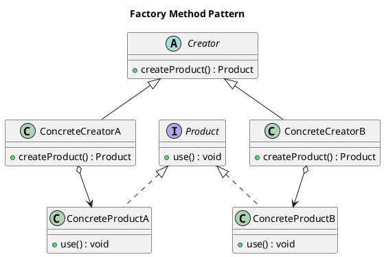

# Factory Method Pattern

## Category
Creational Design Pattern

---

## Overview

The **Factory Method Pattern** is a creational design pattern that provides an interface for creating objects in a superclass, but allows subclasses to decide the type of objects that will be created. This pattern encapsulates the instantiation logic, delegating the responsibility of object creation to specialized subclasses.

The main goal of the Factory Method Pattern is to promote **loose coupling** by separating the client code from the concrete classes it depends on, allowing the system to be easily extended with new object types without modifying existing code.

### **Why Use Factory Method?**
1. To centralize and simplify object creation.
2. To make code scalable and flexible by adhering to the **Open-Closed Principle**.
3. To allow runtime decision-making for object instantiation, based on conditions or configurations.

---

## Key Characteristics

1. **Encapsulation of Object Creation**:
   - Centralizes the creation logic, making it reusable and maintainable.

2. **Open-Closed Principle**:
   - Adding new product types requires creating new subclasses without altering existing code.

3. **Polymorphism**:
   - Products created by the factory method can be used interchangeably, as long as they adhere to a shared interface.

4. **Decoupling**:
   - Separates the client code from the specific implementations of objects.

5. **Flexibility**:
   - Allows different creators to produce different object types dynamically.

---

## UML Diagram

The diagram below illustrates the Factory Method Pattern, showing how the abstract creator delegates the creation of products to concrete subclasses.



---

## Implementation Walkthrough

### 1. Abstract Product
Defines the common interface for all products created by the factory.

```java
public interface Transport {
    void deliver();
}
```

### 2. Concrete Products
Specific implementations of the abstract product.

```java
public class Truck implements Transport {
    @Override
    public void deliver() {
        System.out.println("Delivering by truck on the road.");
    }
}

public class Ship implements Transport {
    @Override
    public void deliver() {
        System.out.println("Delivering by ship across the sea.");
    }
}
```

### 3. Abstract Creator
Declares the factory method (`createTransport`) to be implemented by subclasses.

```java
public abstract class Logistics {
    public abstract Transport createTransport();

    public void planDelivery() {
        Transport transport = createTransport();
        transport.deliver();
    }
}
```

### 4. Concrete Creators
Specialized factories that produce specific types of products.

```java
public class RoadLogistics extends Logistics {
    @Override
    public Transport createTransport() {
        return new Truck();
    }
}

public class SeaLogistics extends Logistics {
    @Override
    public Transport createTransport() {
        return new Ship();
    }
}
```

### 5. Client Code
The client interacts with the abstract creator, unaware of the specific product types.

```java
public class Main {
    public static void main(String[] args) {
        Logistics logistics;

        logistics = new RoadLogistics();
        logistics.planDelivery();

        logistics = new SeaLogistics();
        logistics.planDelivery();
    }
}
```

---

## Example Output

```
Delivering by truck on the road.
Delivering by ship across the sea.
```

---

## Applications

The Factory Method Pattern is ideal for scenarios where:
- The type of objects to be created cannot be determined in advance.
- The creation logic needs to be abstracted from the client.
- Frequent additions of new product types are expected.

### Common Use Cases
1. **Plugin Systems**:
   - Dynamically load plugins at runtime without modifying the core application.

2. **UI Frameworks**:
   - Create platform-specific UI components like buttons or menus.

3. **Parsing Engines**:
   - Instantiate specific parsers (e.g., XML, JSON) based on input formats.

4. **Game Development**:
   - Dynamically create enemies, obstacles, or weapons during gameplay.

---

## Benefits and Drawbacks

### **Benefits**
1. **Flexibility**:
   - Makes the system scalable by enabling runtime selection of object types.
2. **Loose Coupling**:
   - Client code is decoupled from concrete implementations.
3. **Code Reusability**:
   - Centralized object creation logic improves maintainability.
4. **Testability**:
   - Mock objects can easily replace real ones in tests.

### **Drawbacks**
1. **Increased Complexity**:
   - Requires more classes to implement the pattern effectively.
2. **Overhead**:
   - Adds abstraction layers, which might not be necessary for simple applications.

---

## Comparison: Factory Method vs Abstract Factory

| Feature              | Factory Method                          | Abstract Factory                       |
|----------------------|------------------------------------------|----------------------------------------|
| Focus               | Creates a single product at a time.      | Creates families of related products.  |
| Client Interaction  | Relies on a factory method in the creator. | Relies on a factory interface.         |
| Flexibility         | Suitable for single product hierarchies. | Suitable for multiple product families.|

---

## Key Takeaways

- The Factory Method Pattern simplifies object creation while promoting loose coupling and scalability.
- It is particularly useful in scenarios where the product types may evolve over time.
- While it introduces more abstraction, the benefits in flexibility and maintainability often outweigh the added complexity.

---

## Suggestions for Use
- **Use it when**: Object creation is complex or when you anticipate changes to the product hierarchy.
- **Avoid it when**: The product hierarchy is unlikely to change, and simplicity is a higher priority.
