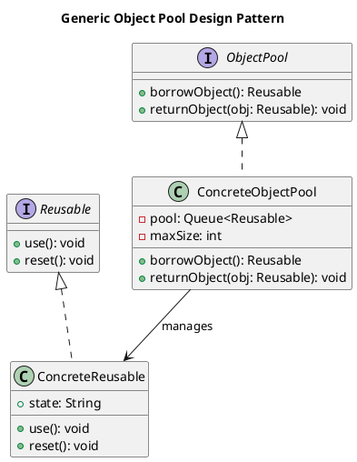

# Object Pool Pattern

## Category
Creational Design Pattern

---

## Overview

The **Object Pool Pattern** is a creational design pattern that manages a pool of reusable objects. Instead of creating and destroying objects frequently, this pattern maintains a set of initialized objects that can be borrowed and returned, improving performance and resource management.

This pattern is particularly useful in scenarios where object creation and destruction are expensive operations, such as managing database connections, thread pools, or large graphics objects.

---

## Key Characteristics

1. **Resource Reuse**:
   - Objects in the pool are reused, reducing the overhead of frequent creation and destruction.

2. **Efficient Resource Management**:
   - Manages the lifecycle of objects, ensuring efficient use of system resources.

3. **Pooling Mechanism**:
   - Maintains a collection of pre-initialized objects that can be borrowed, used, and returned.

4. **Thread-Safety**:
   - Ensures that the pool can safely be used in multi-threaded environments.

---

## UML Diagram

The UML diagram below illustrates the Object Pool Pattern, showing how a client interacts with the pool to borrow and return objects:



---

## Implementation Walkthrough

### Participants

1. **ObjectPool**:
   - Manages a collection of reusable objects.
   - Provides methods to borrow and return objects.

2. **ReusableObject**:
   - Represents the objects that are managed by the pool.

3. **Client**:
   - Interacts with the pool to borrow and return objects.

---

### Example: Database Connection Pool

#### ReusableObject: DatabaseConnection
```java
/**
 * @brief Represents a database connection that can be reused.
 */
public class DatabaseConnection {
    private final String id;

    public DatabaseConnection(String id) {
        this.id = id;
    }

    public void connect() {
        System.out.println("Connecting using connection: " + id);
    }

    public void disconnect() {
        System.out.println("Disconnecting connection: " + id);
    }

    @Override
    public String toString() {
        return "DatabaseConnection{id='" + id + "'}";
    }
}
```

---

#### ObjectPool: ConnectionPool
```java
import java.util.Queue;
import java.util.LinkedList;

/**
 * @brief Manages a pool of reusable database connections.
 */
public class ConnectionPool {
    private final Queue<DatabaseConnection> pool = new LinkedList<>();
    private final int maxSize;

    public ConnectionPool(int maxSize) {
        this.maxSize = maxSize;

        // Initialize the pool with pre-created connections
        for (int i = 1; i <= maxSize; i++) {
            pool.add(new DatabaseConnection("Conn" + i));
        }
    }

    public synchronized DatabaseConnection borrowConnection() {
        if (pool.isEmpty()) {
            throw new RuntimeException("No available connections in the pool!");
        }
        return pool.poll();
    }

    public synchronized void returnConnection(DatabaseConnection connection) {
        if (pool.size() < maxSize) {
            pool.offer(connection);
        }
    }
}
```

---

#### Client Code
```java
/**
 * @brief Demonstrates the Object Pool Pattern using a connection pool.
 */
public class ObjectPoolDemo {
    public static void main(String[] args) {
        ConnectionPool pool = new ConnectionPool(2);

        // Borrow a connection
        DatabaseConnection conn1 = pool.borrowConnection();
        conn1.connect();

        // Borrow another connection
        DatabaseConnection conn2 = pool.borrowConnection();
        conn2.connect();

        // Return connections
        conn1.disconnect();
        pool.returnConnection(conn1);

        conn2.disconnect();
        pool.returnConnection(conn2);

        // Borrow again to demonstrate reuse
        DatabaseConnection conn3 = pool.borrowConnection();
        conn3.connect();
    }
}
```

---

### Output
```
Connecting using connection: Conn1
Connecting using connection: Conn2
Disconnecting connection: Conn1
Disconnecting connection: Conn2
Connecting using connection: Conn1
```

---

## Applications

### When to Use the Object Pool Pattern
1. **Expensive Object Creation**:
   - When objects are costly to create or initialize (e.g., database connections, threads).
2. **Limited Resources**:
   - When the system has a fixed number of resources (e.g., hardware devices, sockets).
3. **High Reuse Rate**:
   - When objects are frequently created and discarded.

### Common Use Cases
1. **Database Connection Pools**:
   - Managing reusable database connections to minimize connection overhead.
2. **Thread Pools**:
   - Managing a pool of threads for efficient execution of parallel tasks.
3. **Graphics Objects**:
   - Reusing large objects like images, textures, or rendering contexts.
4. **Network Connections**:
   - Managing reusable socket connections for network communication.

---

## Advantages and Disadvantages

### Advantages
1. **Performance Improvement**:
   - Reduces the overhead of creating and destroying objects frequently.
2. **Efficient Resource Utilization**:
   - Ensures optimal use of limited resources.
3. **Thread-Safety**:
   - Manages access to shared resources in a multi-threaded environment.
4. **Scalability**:
   - Allows systems to scale more efficiently by reusing objects.

### Disadvantages
1. **Complexity**:
   - Adds complexity in managing the lifecycle of pooled objects.
2. **Potential Resource Leaks**:
   - Failing to return objects to the pool can lead to resource exhaustion.
3. **Overhead**:
   - Managing the pool adds some runtime overhead.

---

## Key Takeaways

The Object Pool Pattern optimizes performance and resource management by reusing objects instead of creating and destroying them repeatedly. It is ideal for scenarios where object creation is expensive or resources are limited, though it introduces complexity in managing the pool and ensuring proper object lifecycle.