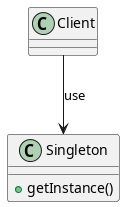

# Singleton Pattern

## Category
Creational Design Pattern

---

## Description

The **Singleton Pattern** is a creational design pattern that ensures a class has only **one instance** throughout the lifetime of an application. It also provides a **global point of access** to that instance, allowing the same object to be used consistently.

The Singleton pattern is particularly useful in scenarios where it is critical to coordinate access to a shared resource or maintain a single state throughout the application.

---

### Key Characteristics

1. **Global Access**:
   - Provides a single point of access to the instance through a static method.

2. **Controlled Instantiation**:
   - Ensures that the class constructor is private, prohibiting direct instantiation.

3. **Lazy Initialization**:
   - The instance is created only when it is first accessed, saving resources if it is not immediately needed.

4. **Thread Safety**:
   - Modern Singleton implementations (e.g., C++11 and Java) ensure that the instance is safely shared across threads.

5. **Single Responsibility Principle**:
   - The Singleton class encapsulates its own instantiation logic, adhering to the Single Responsibility Principle.

---

## Implementation Variations

1. **Eager Initialization**:
   - The instance is created at the time of class loading, ensuring simplicity but potentially wasting resources if unused.

2. **Lazy Initialization**:
   - The instance is created when first requested. This approach is more resource-efficient but may require thread safety mechanisms.

3. **Thread-Safe Initialization**:
   - Ensures that the Singleton instance is safely shared across multiple threads, typically using double-checked locking or modern static initialization techniques.

---

## Use Cases

The Singleton Pattern is ideal when:
- A single instance is required to manage shared resources or state.
- The object needs to coordinate actions across the system.

### Common Applications

1. **Logging Service**:
   - A single logging instance shared across the application for consistent log formatting and output.

2. **Configuration Manager**:
   - Centralized access to application configuration settings.

3. **Resource Management**:
   - Managing a pool of shared resources, such as database connections or thread pools.

4. **State Tracking**:
   - Maintaining a global state, such as an application session or global cache.

---

## Advantages

1. **Controlled Access**:
   - Centralizes and simplifies access to a single instance.

2. **Resource Efficiency**:
   - Prevents the creation of redundant objects.

3. **Global Consistency**:
   - Ensures consistent state management by sharing a single instance across the application.

4. **Thread Safety**:
   - Modern implementations ensure safe access in concurrent environments.

---

## Disadvantages

1. **Global State Dependency**:
   - Overuse of the Singleton pattern can introduce hidden dependencies, making testing and maintenance more challenging.

2. **Difficulty in Testing**:
   - Mocking or replacing a Singleton instance in unit tests can be complex without additional frameworks or techniques.

3. **Potential Resource Waste**:
   - If the Singleton is initialized but never used, resources may be wasted.

---

## UML Diagram

The UML diagram below represents the Singleton pattern. It illustrates how the static method (`getInstance`) ensures that only one instance of the Singleton class is created and shared:

