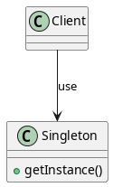

# Singleton Pattern

## Category
Creational Design Pattern

## Description
The Singleton Pattern ensures that a class has only one instance and provides a global point of access to that instance. This pattern is useful when exactly one object is needed to coordinate actions across the system.

### Key Characteristics:
- **Global Access**: Provides a single access point to the instance.
- **Lazy Initialization**: The instance is created only when it is first requested (optional).
- **Thread Safety**: Ensures the instance is safely shared across multiple threads.

---

## Use Cases
- **Logging Service**: A single logger shared across the application.
- **Configuration Manager**: Centralized configuration object.
- **Resource Management**: Managing a limited set of resources (e.g., thread pools, database connections).

---

## UML Diagram
The UML diagram below represents the Singleton pattern:

---

## Implementations

### **C++**
The Singleton is implemented using a static method that returns a single instance of the class.

- **Source Code**: [singleton.cpp](./C++/singleton.cpp)
- **Unit Tests**: [test_singleton.cpp](./C++/test_singleton.cpp)

### **Java**
The Singleton uses lazy initialization with thread safety achieved using the `synchronized` keyword.

- **Source Code**: [Singleton.java](./Java/Singleton.java)
- **Unit Tests**: [SingletonTest.java](./Java/SingletonTest.java)

### **Python**
The Singleton employs the `__new__` method to ensure a single instance.

- **Source Code**: [singleton.py](./Python/singleton.py)
- **Unit Tests**: [test_singleton.py](./Python/test_singleton.py)
