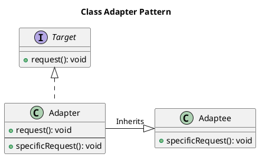
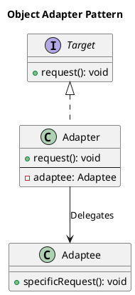

# Adapter Pattern

## Category
Structural Design Pattern

---

## Overview

The **Adapter Pattern** is a **structural design pattern** that enables incompatible interfaces to work together by providing a bridge between them. This pattern involves creating an intermediary (the **Adapter**) that translates requests from the **Client** (using the **Target** interface) into requests understood by the **Adaptee**.

By encapsulating the adaptation logic in a separate class, the Adapter Pattern ensures that neither the client nor the adaptee needs to be modified, promoting reusability and adherence to the **Open-Closed Principle**.

The Adapter Pattern is particularly useful in the following scenarios:
- **Legacy System Integration**: When a legacy class or system with an existing interface needs to be integrated into a new system.
- **Third-Party Libraries**: When a third-party library provides functionality that needs to be adapted to conform to the client’s expectations.
- **API Bridging**: When connecting two APIs or frameworks with incompatible interfaces.

---

## Key Characteristics

1. **Interface Translation**:
   - The Adapter Pattern allows objects with incompatible interfaces to interact by translating client requests into a form that the adaptee can understand.

2. **Encapsulation**:
   - The adapter encapsulates the adaptee, making the adaptee’s implementation details transparent to the client.

3. **Decoupling**:
   - The client interacts with the target interface, and the adapter manages the interaction with the adaptee. This decouples the client from the adaptee's specific implementation.

4. **Reusability**:
   - Adapters enable the reuse of existing classes without requiring modifications to their interfaces.

5. **Adherence to SOLID Principles**:
   - **Open-Closed Principle**: The adapter introduces new behavior without modifying existing code.
   - **Single Responsibility Principle**: The adapter focuses on translating between interfaces, while the adaptee retains its original functionality.

6. **Two Main Variants**:
   - **Class Adapter**: Achieved using inheritance. The adapter inherits from both the target and adaptee interfaces. Common in languages that support multiple inheritance.
   - **Object Adapter**: Achieved using composition. The adapter holds a reference to the adaptee and delegates calls to it. This is more flexible and widely used.

7. **Runtime Flexibility**:
   - Adapters can be instantiated dynamically based on client requirements, making them suitable for scenarios requiring multiple adaptations.

8. **Single or Bidirectional Translation**:
   - Adapters can perform one-way translation (from target to adaptee) or two-way translation (enabling mutual interaction between incompatible interfaces).

---

## UML Diagrams

### **Class Adapter**

The **Class Adapter** uses inheritance to adapt the Adaptee to the Target interface. This approach requires that the Adapter inherit from both the Target and Adaptee, which is possible in languages supporting multiple inheritance (e.g., C++). It is less flexible but can directly override Adaptee behavior if necessary.

#### UML for Class Adapter


---

### **Object Adapter**

The **Object Adapter** uses composition to adapt the Adaptee to the Target interface. The Adapter holds a reference to the Adaptee and delegates requests to it. This approach is more flexible because the Adapter can work with multiple Adaptee instances.

#### UML for Object Adapter


---

## Comparison of Variants

| Feature                  | Class Adapter                        | Object Adapter                      |
|--------------------------|---------------------------------------|--------------------------------------|
| **Implementation**       | Inheritance (extends Adaptee).       | Composition (uses Adaptee instance). |
| **Flexibility**          | Limited; binds to a single Adaptee.  | High; can work with multiple Adaptees. |
| **Language Dependence**  | Requires multiple inheritance.       | Works in most object-oriented languages. |
| **Ease of Maintenance**  | More tightly coupled.                | Looser coupling improves maintainability. |
| **Usage Preference**     | Rarely used in modern systems.       | Preferred due to flexibility.        |

---

## Implementation Walkthrough

### Participants

1. **Target**:
   - Defines the domain-specific interface that the client expects.

2. **Adaptee**:
   - Defines an existing interface that needs adapting.

3. **Adapter**:
   - Implements the Target interface and translates requests to the Adaptee.

4. **Client**:
   - Interacts with the system through the Target interface.

---

### Example: Media Player Adapter

#### Target Interface
```java
/**
 * @brief Defines the interface expected by the client.
 */
public interface MediaPlayer {
	void play(String audioType, String fileName);
}
```

---

#### Adaptee Interface
```java
/**
 * @brief Defines the interface for advanced media players.
 */
public interface AdvancedMediaPlayer {
	void play(String fileName);
}
```

---

#### Concrete Adaptee Implementations
```java
/**
 * @brief Concrete Adaptee for playing MP4 files.
 */
public class Mp4Player implements AdvancedMediaPlayer {
	@Override
	public void play(String fileName) {
		System.out.println("Playing MP4 file: " + fileName);
	}
}

/**
 * @brief Concrete Adaptee for playing VLC files.
 */
public class VlcPlayer implements AdvancedMediaPlayer {
	@Override
	public void play(String fileName) {
		System.out.println("Playing VLC file: " + fileName);
	}
}
```

---

#### Adapter Class
```java
/**
 * @brief The Adapter bridges the MediaPlayer interface with AdvancedMediaPlayer.
 */
public class MediaAdapter implements MediaPlayer {
	private AdvancedMediaPlayer advancedMediaPlayer;

	public MediaAdapter(String audioType) {
		if (audioType.equalsIgnoreCase("mp4")) {
			this.advancedMediaPlayer = new Mp4Player();
		} else if (audioType.equalsIgnoreCase("vlc")) {
			this.advancedMediaPlayer = new VlcPlayer();
		} else {
			throw new IllegalArgumentException("Unsupported audio type: " + audioType);
		}
	}

	@Override
	public void play(String audioType, String fileName) {
		advancedMediaPlayer.play(fileName);
	}
}
```

---

#### Client Implementation
```java
/**
 * @brief The Client uses the MediaPlayer interface to interact with the system.
 */
public class AudioPlayer implements MediaPlayer {
	@Override
	public void play(String audioType, String fileName) {
		if (audioType.equalsIgnoreCase("mp3")) {
			System.out.println("Playing MP3 file: " + fileName);
		} else if (audioType.equalsIgnoreCase("mp4") || audioType.equalsIgnoreCase("vlc")) {
			MediaPlayer adapter = new MediaAdapter(audioType);
			adapter.play(audioType, fileName);
		} else {
			System.out.println("Invalid media type: " + audioType);
		}
	}
}
```

---

#### Client Code
```java
/**
 * @brief Demonstrates the use of the Adapter Pattern.
 */
public class AdapterPatternDemo {
	public static void main(String[] args) {
		AudioPlayer player = new AudioPlayer();

		player.play("mp3", "song.mp3");
		player.play("mp4", "video.mp4");
		player.play("vlc", "movie.vlc");
		player.play("avi", "unsupported.avi");
	}
}
```

---

### Output
```
Playing MP3 file: song.mp3
Playing MP4 file: video.mp4
Playing VLC file: movie.vlc
Invalid media type: avi
```

---

## Applications

### When to Use the Adapter Pattern
1. **Legacy System Integration**:
   - Adapting new interfaces to work with existing systems.
2. **Third-Party Library Integration**:
   - Using external libraries with incompatible interfaces.
3. **UI Components**:
   - Bridging different frameworks or libraries for UI components.

### Common Use Cases
1. **Media Players**:
   - Adapting different formats like MP4, VLC, or MP3.
2. **Payment Gateways**:
   - Integrating multiple payment processors with different APIs.
3. **Database Abstractions**:
   - Adapting different database drivers or APIs.

---

## Advantages and Disadvantages

### Advantages
1. **Reusability**:
   - Allows existing code to work with new systems without modification.
2. **Encapsulation**:
   - Encapsulates the adaptee's interface, simplifying the client code.
3. **Flexibility**:
   - Adapts incompatible interfaces at runtime.

### Disadvantages
1. **Complexity**:
   - Introduces additional layers, increasing system complexity.
2. **Performance**:
   - May introduce slight overhead due to additional abstraction.
3. **Maintenance**:
   - Requires maintaining the adapter code along with the adaptee and target.

---

## Key Takeaways

The **Adapter Pattern** is a powerful tool for bridging the gap between incompatible interfaces. By encapsulating adaptation logic in a dedicated class, it promotes code reuse and decouples client code from specific implementations.

- **Use it when**: You need to integrate incompatible interfaces without modifying their source.
- **Avoid it when**: Direct modification or subclassing is a simpler solution.