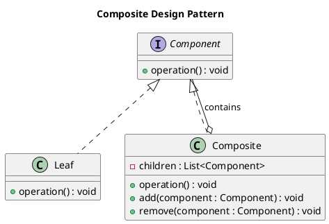

# Composite Pattern

## **Category**
Structural Design Pattern

---

## **Overview**

The **Composite Pattern** is a **structural design pattern** that enables you to compose objects into tree structures to represent part-whole hierarchies. It allows clients to treat individual objects and compositions of objects uniformly, promoting a recursive structure.

This pattern is particularly useful when dealing with a system of objects that must be treated the same way regardless of whether they are individual elements or collections of elements. It is commonly used in graphical user interfaces, document editors, and any scenario where objects need hierarchical organization.

---

## **Key Characteristics**

1. **Tree Structure**:
   - The pattern organizes objects into a hierarchical tree structure, where each node can be either a leaf or a composite (containing other nodes).

2. **Uniformity**:
   - The client interacts with objects through a common interface, treating leaves and composites uniformly.

3. **Recursive Composition**:
   - Composites can contain both leaves and other composites, enabling recursive tree structures.

4. **Transparency**:
   - Simplifies the client by providing a single interface, hiding whether an object is a leaf or a composite.

5. **Flexibility**:
   - Makes it easy to add new types of components by extending the base component class.

---

## **UML Diagram**

The UML diagram below illustrates the Composite Pattern, showing the relationships between the **Component**, **Leaf**, and **Composite**.



---

## **Implementation Walkthrough**

### **Participants**

1. **Component**:
   - Declares the interface for all objects in the composition, including leaves and composites.

2. **Leaf**:
   - Represents the end objects of the composition. A leaf has no children and implements the component interface.

3. **Composite**:
   - Represents a container of components, managing child components and implementing the component interface.

4. **Client**:
   - Interacts with objects in the composition through the component interface.

---

### **Example: File System**

The Composite Pattern can represent a file system, where:
- **Files** are leaves (cannot contain other elements).
- **Folders** are composites (can contain files and other folders).

#### **Component Interface**
```java
/**
 * @brief Interface for both leaf and composite elements.
 */
public interface FileSystemComponent {
    void display(String indent);
}
```

---

#### **Leaf**
```java
/**
 * @brief Represents a file in the file system.
 */
public class File implements FileSystemComponent {
    private String name;

    public File(String name) {
        this.name = name;
    }

    @Override
    public void display(String indent) {
        System.out.println(indent + "File: " + name);
    }
}
```

---

#### **Composite**
```java
import java.util.ArrayList;
import java.util.List;

/**
 * @brief Represents a folder containing files and other folders.
 */
public class Folder implements FileSystemComponent {
    private String name;
    private List<FileSystemComponent> children = new ArrayList<>();

    public Folder(String name) {
        this.name = name;
    }

    public void add(FileSystemComponent component) {
        children.add(component);
    }

    public void remove(FileSystemComponent component) {
        children.remove(component);
    }

    @Override
    public void display(String indent) {
        System.out.println(indent + "Folder: " + name);
        for (FileSystemComponent child : children) {
            child.display(indent + "  ");
        }
    }
}
```

---

#### **Client**
```java
/**
 * @brief Demonstrates the Composite Pattern using a file system hierarchy.
 */
public class CompositePatternDemo {
    public static void main(String[] args) {
        // Create files
        File file1 = new File("file1.txt");
        File file2 = new File("file2.txt");
        File file3 = new File("file3.txt");

        // Create folders and add files
        Folder folder1 = new Folder("folder1");
        folder1.add(file1);
        folder1.add(file2);

        Folder folder2 = new Folder("folder2");
        folder2.add(file3);

        // Create root folder and add subfolders
        Folder root = new Folder("root");
        root.add(folder1);
        root.add(folder2);

        // Display the hierarchy
        root.display("");
    }
}
```

---

### **Output**
```
Folder: root
  Folder: folder1
    File: file1.txt
    File: file2.txt
  Folder: folder2
    File: file3.txt
```

---

## **Applications**

### **When to Use the Composite Pattern**
1. **Part-Whole Hierarchies**:
   - When dealing with systems where objects can be part of a hierarchy, such as a tree structure.
2. **Uniform Client Interface**:
   - When clients should treat individual objects and compositions uniformly.
3. **Recursive Structures**:
   - When objects need to be organized recursively.

### **Common Use Cases**
1. **File Systems**:
   - Folders as composites and files as leaves.
2. **Graphical User Interfaces**:
   - Containers (e.g., panels, windows) as composites and widgets (e.g., buttons, text fields) as leaves.
3. **Document Editors**:
   - Paragraphs, sentences, and words as leaves; sections and chapters as composites.
4. **Game Development**:
   - Hierarchical structures like game scenes, levels, and game objects.

---

## **Advantages and Disadvantages**

### **Advantages**
1. **Simplified Client Code**:
   - Uniform interface for interacting with both individual objects and compositions.
2. **Extensibility**:
   - Easy to add new component types by extending the base component class.
3. **Recursive Structures**:
   - Naturally represents hierarchical relationships.

### **Disadvantages**
1. **Overhead**:
   - Managing a composite structure can introduce additional complexity.
2. **Lack of Type Safety**:
   - Treating leaves and composites uniformly can lead to runtime errors if the client expects a specific type.
3. **Performance**:
   - Recursive calls to process large trees can be inefficient.

---

## **Key Takeaways**

- The **Composite Pattern** is ideal for systems with hierarchical structures where individual objects and groups of objects need to be treated uniformly.
- It simplifies client code, promotes recursive structures, and enhances system flexibility.
- While it introduces some complexity in managing the hierarchy, it is a powerful tool for organizing and interacting with part-whole relationships in software systems.