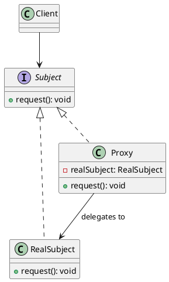

# Proxy Pattern

## Category
Structural Design Pattern

---

## Overview

The **Proxy Pattern** provides a surrogate or placeholder for another object to control access to it. The proxy object acts as an intermediary between a client and the real subject, adding a layer of control over the access to the real subject. 

This pattern is particularly useful when:
- Direct access to an object is not desirable or feasible.
- Additional functionality, such as lazy initialization, access control, or logging, is needed.

---

## Key Characteristics

1. **Access Control**:
   - The proxy controls access to the real subject, ensuring that only authorized clients can interact with it.

2. **Lazy Initialization**:
   - The proxy can defer the creation or initialization of the real subject until it is actually needed.

3. **Performance Optimization**:
   - In scenarios like remote method invocation, the proxy can minimize expensive operations by caching results or batching requests.

4. **Logging and Monitoring**:
   - Proxies can add functionality for logging, monitoring, or debugging without altering the real subject's code.

5. **Structural Similarity**:
   - The proxy implements the same interface as the real subject, allowing it to be used interchangeably with the real subject in client code.

---

## UML Diagram

The UML diagram below illustrates the Proxy Pattern, showing the relationship between the **Proxy**, **Real Subject**, and the **Client**.



---

## Implementation Walkthrough

### Participants

1. **Subject**:
   - Defines the common interface for the proxy and the real subject.

2. **Real Subject**:
   - Implements the Subject interface and contains the actual business logic.

3. **Proxy**:
   - Implements the Subject interface and controls access to the real subject.

4. **Client**:
   - Interacts with the proxy, which in turn delegates requests to the real subject.

---

### Example: Remote File Access

#### Subject Interface
```java
/**
 * @brief The Subject interface defines the common operations for the Proxy and RealSubject.
 */
public interface FileService {
    void readFile(String fileName);
}
```

---

#### Real Subject
```java
/**
 * @brief The RealSubject performs the actual work of reading a file.
 */
public class RealFileService implements FileService {
    @Override
    public void readFile(String fileName) {
        System.out.println("Reading file: " + fileName);
    }
}
```

---

#### Proxy
```java
/**
 * @brief The Proxy controls access to the RealSubject.
 */
public class FileServiceProxy implements FileService {
    private RealFileService realFileService;
    private boolean isAuthenticated;

    public FileServiceProxy(boolean isAuthenticated) {
        this.isAuthenticated = isAuthenticated;
    }

    @Override
    public void readFile(String fileName) {
        if (!isAuthenticated) {
            System.out.println("Access denied. Please authenticate to read the file.");
            return;
        }
        if (realFileService == null) {
            realFileService = new RealFileService();
        }
        realFileService.readFile(fileName);
    }
}
```

---

#### Client Code
```java
/**
 * @brief Client demonstrating the Proxy Pattern.
 */
public class ProxyPatternDemo {
    public static void main(String[] args) {
        FileService proxy = new FileServiceProxy(false);
        proxy.readFile("example.txt"); // Access denied.

        proxy = new FileServiceProxy(true);
        proxy.readFile("example.txt"); // File is read.
    }
}
```

---

### Output
```
Access denied. Please authenticate to read the file.
Reading file: example.txt
```

---

## Applications

### When to Use the Proxy Pattern
1. **Access Control**:
   - Restrict access to sensitive or secure resources.
2. **Lazy Initialization**:
   - Delay expensive operations until they are needed.
3. **Remote Access**:
   - Provide local representation for an object in a different address space (e.g., RPC, RMI).
4. **Logging and Caching**:
   - Add logging or caching layers without modifying the real subject.

### Common Use Cases
1. **Virtual Proxy**:
   - Defer the creation or loading of an expensive object until it is needed.
2. **Remote Proxy**:
   - Represent an object located remotely, handling communication.
3. **Protection Proxy**:
   - Add authentication or authorization checks before granting access.
4. **Smart Proxy**:
   - Provide additional functionality such as reference counting or resource management.

---

## Advantages and Disadvantages

### Advantages
1. **Encapsulation**:
   - The proxy encapsulates additional functionality, keeping the real subject unaltered.
2. **Lazy Initialization**:
   - Saves resources by deferring initialization until required.
3. **Decoupling**:
   - The client remains unaware of the proxy, interacting only with the Subject interface.

### Disadvantages
1. **Increased Complexity**:
   - Adds extra layers, making the design more complex.
2. **Potential Performance Overhead**:
   - Depending on implementation, proxies can introduce delays or additional processing.

---

## Key Takeaways

The **Proxy Pattern** is a structural design pattern that provides a level of indirection to control access to an object. It is versatile and commonly used in scenarios requiring security, performance optimization, or distributed systems.

- **Use it when**: You need controlled access, lazy initialization, or remote representation for an object.
- **Avoid it when**: The added complexity outweighs the benefits for your use case.